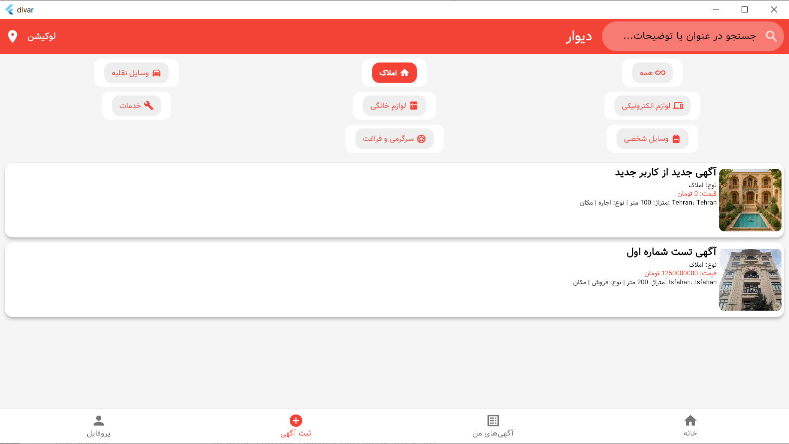
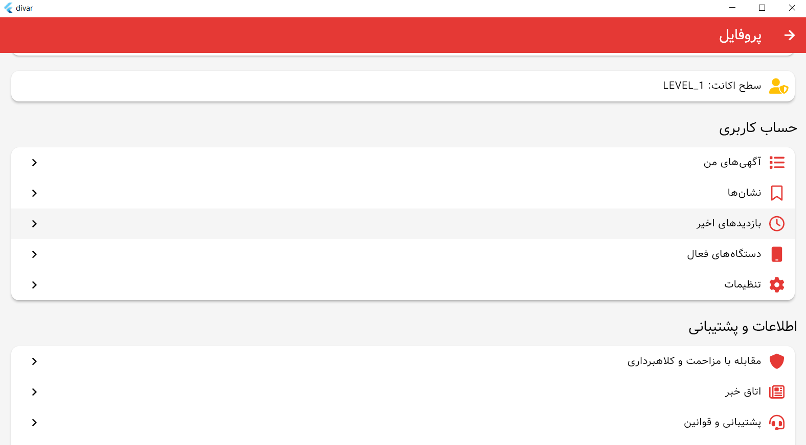
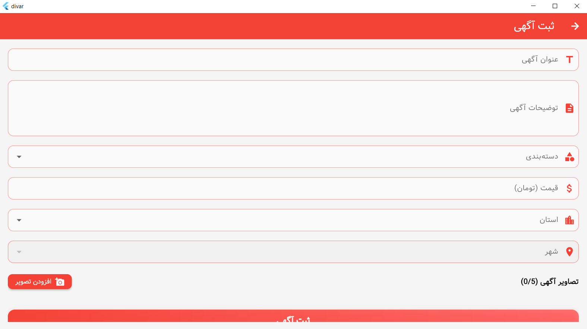

## 🏡🚗 Ad Details App — Your Smart Gateway to Classified Listings

**Ad Details App** is a beautifully crafted, full-stack Flutter application designed to bring a smooth, intuitive experience to users browsing detailed listings — whether you're house hunting or car shopping!
With a clean, modern UI and robust backend, it turns everyday classifieds into an interactive, delightful platform.

### ✨ What Makes It Awesome?

* 🖼 **Stunning Image Carousel**
  Glide through multiple images of each listing with elegant, touch-friendly controls.

* ⭐ **One-Tap Bookmarking**
  Save your favorite ads for later — effortlessly. *(Requires login)*

* 💬 **Commenting System**
  Engage with listings by leaving feedback or questions. *(Mocked in frontend for now)*

* 🏠🚙 **Detailed Real Estate & Vehicle Info**
  Whether it’s the **square footage of a house** or the **mileage on a car**, we show what matters.

* 📱 **Responsive Flutter UI**
  Smooth, mobile-first experience — scales beautifully across all devices.

* 🔐 **Authentication Made Simple**
  Login with your phone number in seconds.

* 🌐 **Full-Stack Power**

  * **Frontend:** Flutter
  * **Backend:** Node.js
  * **Database:** MySQL
    *(Backend lives in a separate repo: `divar-backend`)*

* 🧩 **RESTful API Integration**
  Clean and scalable API endpoints for ad management, user auth, and bookmarks.

## 📸 Screenshots

Here are a few glimpses of the app in action:

### 🏠 Home Screen

### 📄 Ad Details

### ⭐ Bookmarked Ads

