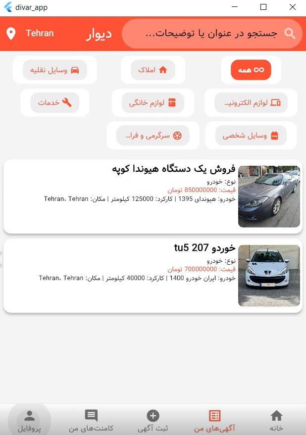
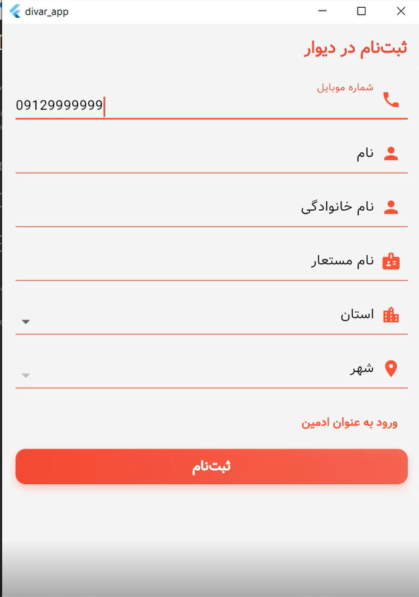
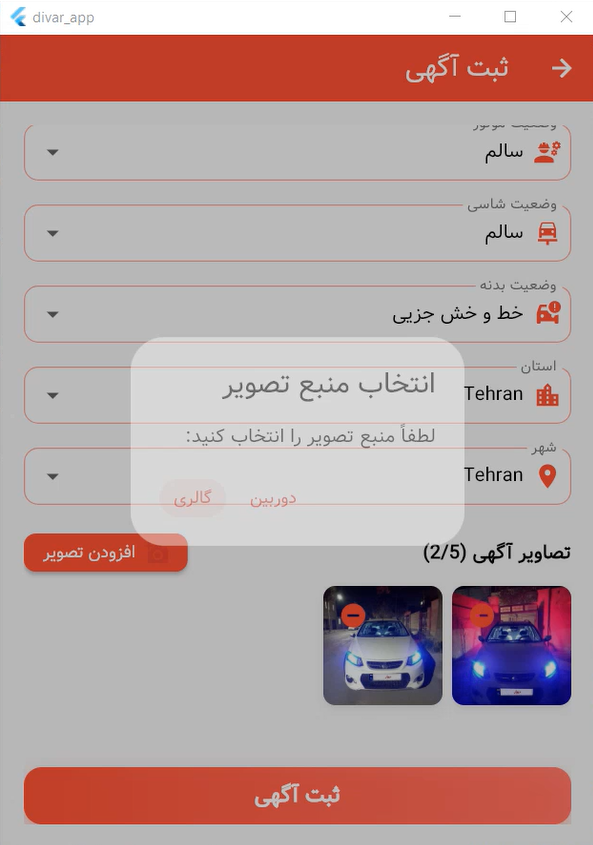
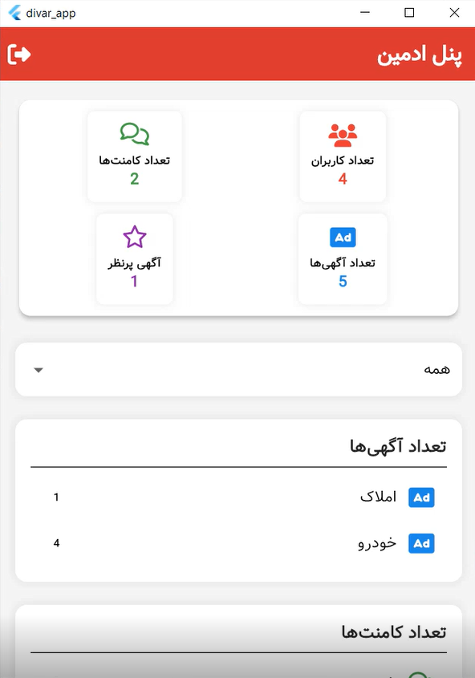
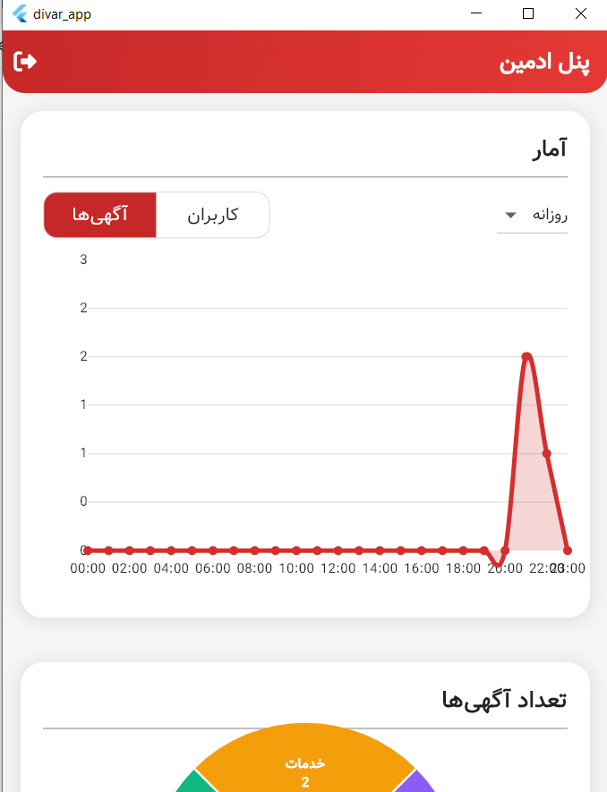

# Ad Details App

A full-stack Flutter application for displaying detailed information about advertisements, such as real estate or vehicle listings. The app features a clean and responsive UI with functionalities like image carousels, bookmarking, commenting, and detailed property or vehicle information. The backend is powered by Node.js with a RESTful API and a MySQL database, hosted in a separate repository: `divar-backend`.

---

## 🚀 Features

- **Image Carousel:** View multiple images of the ad with navigation controls.
- **Bookmarking:** Users can bookmark ads for quick access (requires authentication).
- **Commenting:** Add and view comments on ads (mock implementation in frontend).
- **Detailed Information:** Display specific details for real estate (e.g., area, rooms) or vehicles (e.g., brand, mileage).
- **Responsive UI:** Optimized for various screen sizes with smooth scrolling.
- **Authentication:** Integrated with a phone number-based auth system.
- **Full-Stack Architecture:** Frontend built with Flutter, backend powered by Node.js, and MySQL database for data storage.
- **RESTful API:** Provides endpoints for ad management, user authentication, and bookmarking.

---

## 🧰 Tech Stack

| Layer    | Technology           |
| -------- | -------------------- |
| Frontend | Flutter              |
| Backend  | Node.js + Express    |
| Database | MySQL                |

---

## 📸 Screenshots

  <h4>🏠 Project Images</h4>
  
  
  
  
  
  
  
  
  
  

  <h4>🏠 💎 Admin pannel</h4>

  
  
  
  

